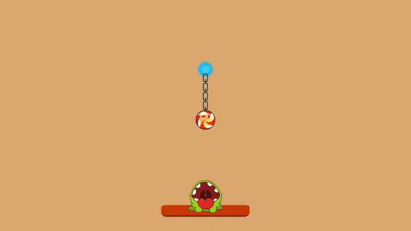

# Cut_The_Rope_Replic

A "Cut the Rope" game replica, 2D fun mobile game about helping the frog get the candy.

## Screenshot:

## Game logic:
Cut lines in a smart way to get the frog to eat the candy.

## Tools used:
* Visual studio Code (Text Editor)
* C# (logic)
* Unity (game engine)
* Paint.Net (Image editting)

## Contribution:
Feel free to `fork` this project and add whatever you like. If you have any suggestions or any comments please feel free to contact me or to open an issue, use free license art assets please.

## Team:
[Jetlighters](https://github.com/JetLightStudio) having fun.
